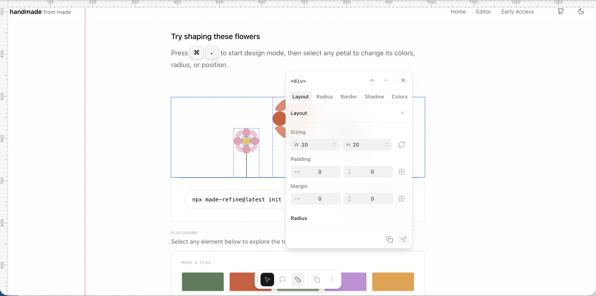

# handmade

[](https://www.npmjs.com/package/made-refine) [](https://www.npmjs.com/package/made-refine)

Visual CSS editor for React. Edit styles in the browser, then copy agent-ready edits with component and file context.

<p align="center">
  
</p>

## Quick start

```bash
npx made-refine@latest init
```

Run this in your project folder. It detects your framework, installs everything, and applies the necessary config changes after your confirmation.

## How it works

1. **Start your dev server** as usual.
2. **Press `Cmd + .`** (or `Ctrl + .`) to open the editor right in the browser, on your running app.
3. **Click any element** on the page to select it.
4. **Edit visually** — adjust layout, spacing, radius, borders, shadows, colors, move elements, and edit text directly from the side panel. Undo anytime with `Cmd + Z`.
5. **Copy the changes** — edits are formatted with the component name, file path, and exact CSS changes so you can paste them straight into Cursor or Claude Code.

Your app keeps running normally. The editor floats on top and never touches your actual styles until you apply the changes through your AI coding agent.

## Adding handmade to your project

### Setup

1. **Open the terminal** in your project folder and run:
   ```bash
   npx made-refine@latest init
   ```
2. **Review and confirm** the config changes when prompted. That's it — handmade is installed.

### Using the editor

1. **Start your dev server** and open the app in the browser.
2. **Press `Cmd + .`** on Mac (or `Ctrl + .` on Windows) to turn on the editor.
3. **Click any element** — a text block, a button, an image, anything on the page.
4. **Make your changes** using the side panel:
   - **Layout** — adjust padding, margin, sizing, and flex alignment
   - **Colors** — change background, text, border, and outline colors
   - **Radius** — round corners individually or all at once
   - **Borders** — set style, width, and color per side
   - **Shadows** — add and layer drop shadows
   - **Typography** — change font, size, weight, spacing, and alignment
   - **Move** — drag elements to reposition them
   - **Text** — press `Enter` on a text element to edit its content directly
5. **Undo** with `Cmd + Z`.
6. **Click the copy button** to grab your edits. Paste them into Cursor or Claude Code — the edit includes the file name and component so the AI knows exactly where to apply it.

## License

[FSL-1.1-MIT](./LICENSE)
